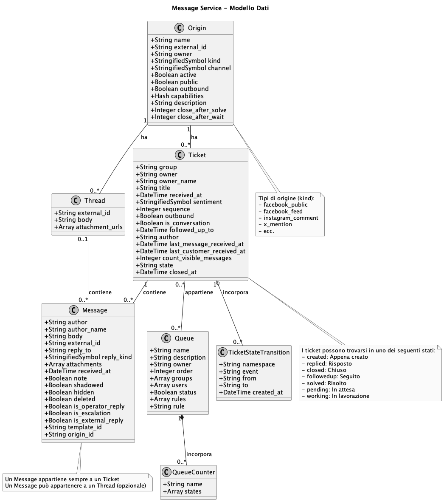

# Troubleshooting

Message Service uses MongoDB come archivio dati primario, con le seguenti collezioni principali:

1. **Messages**: Rappresenta le comunicazioni individuali tra clienti e operatori
2. **Threads**: Raggruppa messaggi correlati in una conversazione
3. **Tickets**: Rappresenta i casi di supporto clienti contenenti messaggi
4. **Origins**: Rappresenta i canali di comunicazione (social media, piattaforme di messaggistica)
5. **Queues**: Organizza i ticket in base a regole specifiche

Inoltre, ci sono documenti incorporati e collezioni correlate:

- **QueueCounters**: Incorporati nelle Queues per tracciare il conteggio dei ticket per stato
- **TicketStateTransitions**: Incorporati nei Tickets per tracciare i cambiamenti di stato
- **AiMessages**: Sottoclasse di Messages per contenuti generati dall'IA
- **AiSuggestions**: Correlati ai Tickets per risposte suggerite dall'IA

## Diagramma UML del Modello Dati

Il seguente diagramma UML illustra le entità principali del modello dati e le loro relazioni:

<!--  -->

## Collezioni

### Collezione Messages

Rappresenta le comunicazioni individuali tra clienti e operatori.

**Campi:**

- `_id`: ObjectId (identificatore documento MongoDB)
- `author`: String (identificatore dell'autore del messaggio)
- `author_name`: String (nome dell'autore)
- `body`: String (contenuto del messaggio)
- `external_id`: String (identificatore dal sistema esterno)
- `reply_to`: String (riferimento al messaggio a cui si risponde)
- `reply_kind`: StringifiedSymbol (tipo di risposta: retweet, quote, reply, responder, bump)
- `attachments`: Array (lista di allegati)
- `received_at`: DateTime (quando il messaggio è stato ricevuto)
- `note`: Boolean (indica se il messaggio è una nota interna)
- `extra`: Hash (dati aggiuntivi)
- `shadowed`: Boolean (indica se il messaggio è nascosto nell'UI quando l'origine è disabilitata)
- `hidden`: Boolean (indica se il messaggio è nascosto dal canale social)
- `deleted`: Boolean (indica se il messaggio è eliminato dal canale ma visibile nell'UI)
- `is_operator_reply`: Boolean (indica se il messaggio proviene da un operatore)
- `is_escalation`: Boolean (indica se il messaggio è un'escalation)
- `is_external_reply`: Boolean (indica se il messaggio proviene da un sistema esterno)
- `template_id`: String (template utilizzato per il messaggio)
- `origin_id`: String (riferimento denormalizzato all'origine)
- `created_at`: DateTime (quando il documento è stato creato)
- `updated_at`: DateTime (quando il documento è stato aggiornato l'ultima volta)

**Relazioni:**

- Appartiene a un Thread (opzionale)
- Appartiene a un Ticket

**Indici:**

- `ticket_id`: Per interrogazioni efficienti dei messaggi per ticket
- `shadowed`: Per filtrare i messaggi nascosti
- `hidden`: Per filtrare i messaggi nascosti
- `deleted`: Per filtrare i messaggi eliminati
- `is_operator_reply`: Per filtrare le risposte degli operatori
- `is_external_reply`: Per filtrare le risposte esterne
- `is_escalation`: Per filtrare i messaggi di escalation

**Ricerca:**

- Utilizza Searchkick per la ricerca full-text e l'indicizzazione

### Collezione AiMessages

Sottoclasse di Messages che rappresenta contenuti generati dall'IA.

**Campi Aggiuntivi:**

- Eredita tutti i campi da Messages
- Può contenere campi specifici per l'IA

**Relazioni:**

- Stesse di Messages

### Collezione Threads

Raggruppa messaggi correlati in una conversazione.

**Campi:**

- `_id`: ObjectId (identificatore documento MongoDB)
- `external_id`: String (identificatore dal sistema esterno)
- `body`: String (contenuto del thread)
- `attachment_urls`: Array (lista di URL degli allegati)

**Relazioni:**

- Appartiene a una Origin
- Ha molti Messages

**Indici:**

- `external_id` e `origin_id`: Indice unico per l'identificazione del thread

### Collezione Tickets

Rappresenta i casi di supporto clienti contenenti messaggi.

**Campi:**

- `_id`: ObjectId (identificatore documento MongoDB)
- `group`: String (gruppo assegnato al ticket)
- `owner`: String (proprietario del ticket)
- `owner_name`: String (nome del proprietario)
- `title`: String (titolo del ticket)
- `received_at`: DateTime (quando il ticket è stato ricevuto)
- `sentiment`: StringifiedSymbol (sentimento del ticket: negative, neutral, positive, not_assigned)
- `sequence`: Integer (numero sequenziale del ticket)
- `outbound`: Boolean (indica se il ticket è stato creato per un messaggio in uscita)
- `is_conversation`: Boolean (indica se il ticket è una conversazione)
- `followed_up_to`: DateTime (data fino a cui il ticket è stato seguito)
- `author`: String (autore denormalizzato)
- `last_message_received_at`: DateTime (quando è stato ricevuto l'ultimo messaggio)
- `last_customer_received_at`: DateTime (quando è stato ricevuto l'ultimo messaggio del cliente)
- `count_visible_messages`: Integer (conteggio dei messaggi visibili)
- `state`: String (stato del ticket: created, replied, closed, followedup, solved, pending, working)
- `closed_at`: DateTime (quando il ticket è stato chiuso)
- `created_at`: DateTime (quando il documento è stato creato)
- `updated_at`: DateTime (quando il documento è stato aggiornato l'ultima volta)

**Relazioni:**

- Appartiene a una Origin
- Ha molti Messages
- Ha molti AiSuggestions
- Ha molti AiMessages
- Ha e appartiene a molte Queues
- Incorpora molti TicketStateTransitions

**Indici:**

- `created_at`: Per ordinare per data di creazione
- `updated_at`: Per ordinare per data di aggiornamento
- `outbound`: Per filtrare i ticket in uscita
- `last_message_received_at`: Per ordinare per data dell'ultimo messaggio

**Macchina a Stati:**

- Implementa una macchina a stati per gli stati dei ticket
- Stati: created, replied, closed, followedup, solved, pending, working
- Le transizioni tra stati sono gestite dal concern TicketStateMachine

### Collezione Origins

Rappresenta i canali di comunicazione da cui provengono i messaggi.

**Campi:**

- `_id`: ObjectId (identificatore documento MongoDB)
- `name`: String (nome dell'origine)
- `external_id`: String (identificatore dal sistema esterno)
- `owner`: String (proprietario dell'origine)
- `kind`: StringifiedSymbol (tipo di origine: facebook_public, instagram_comment, x_mention, ecc.)
- `channel`: StringifiedSymbol (canale: facebook, instagram, whatsapp, x, ecc.)
- `active`: Boolean (indica se l'origine è attiva)
- `public`: Boolean (indica se l'origine è pubblica)
- `outbound`: Boolean (indica se l'origine supporta messaggi in uscita)
- `capabilities`: Hash (capacità dell'origine)
- `description`: String (descrizione dell'origine)
- `locking_name`: String (nome per il blocco)
- `locked_at`: Time (quando l'origine è stata bloccata)
- `close_after_solve`: Integer (ore dopo le quali chiudere i ticket risolti)
- `close_after_wait`: Integer (ore dopo le quali chiudere i ticket in attesa)

**Relazioni:**

- Ha molti Threads
- Ha molti Tickets

**Indici:**

- `external_id`, `owner`, e `kind`: Indice unico per l'identificazione dell'origine

### Collezione Queues

Organizza i ticket in base a regole specifiche.

**Campi:**

- `_id`: ObjectId (identificatore documento MongoDB)
- `name`: String (nome della coda)
- `description`: String (descrizione della coda)
- `owner`: String (proprietario della coda)
- `order`: Integer (ordine di visualizzazione)
- `groups`: Array (gruppi associati alla coda)
- `users`: Array (utenti associati alla coda)
- `status`: Boolean (stato della coda)
- `rules`: Array (regole per la coda)
- `rule`: String (ID della regola dal rule-engine)
- `created_at`: DateTime (quando il documento è stato creato)
- `updated_at`: DateTime (quando il documento è stato aggiornato l'ultima volta)

**Relazioni:**

- Ha e appartiene a molti Tickets
- Incorpora molti QueueCounters

**Documenti Incorporati:**

- QueueCounters: Traccia il numero di ticket in ogni stato

### Documenti Incorporati

#### QueueCounter

Incorporato nelle Queues per tracciare il conteggio dei ticket per stato.

**Campi:**

- `_id`: ObjectId (identificatore documento MongoDB)
- `name`: String (nome del contatore)
- `states`: Array (stati da contare)

#### TicketStateTransition

Incorporato nei Tickets per tracciare i cambiamenti di stato.

**Campi:**

- `_id`: ObjectId (identificatore documento MongoDB)
- `namespace`: String (namespace dell'evento)
- `event`: String (evento che ha causato la transizione)
- `from`: String (stato prima della transizione)
- `to`: String (stato dopo la transizione)
- `created_at`: DateTime (quando è avvenuta la transizione)

## Panoramica delle Relazioni

1. **Origin → Ticket → Message**:
   - Una Origin ha molti Tickets
   - Un Ticket ha molti Messages
   - Un Message appartiene a un Ticket

2. **Origin → Thread → Message**:
   - Una Origin ha molti Threads
   - Un Thread ha molti Messages
   - Un Message può appartenere a un Thread (opzionale)

3. **Ticket ↔ Queue**:
   - Un Ticket può appartenere a molte Queues
   - Una Queue può contenere molti Tickets
   - Una Queue incorpora molti QueueCounters per tracciare i conteggi

4. **Ticket → TicketStateTransition**:
   - Un Ticket incorpora molti TicketStateTransitions che registrano i cambiamenti di stato

## Indicizzazione e Ricerca

- I Messages sono indicizzati utilizzando Searchkick per la ricerca full-text
- Vari indici sono definiti sulle collezioni per interrogazioni efficienti
- I dati di ricerca per i messaggi includono informazioni denormalizzate dai ticket e dalle origini correlate

## Flusso dei Dati

1. **Ricezione del Messaggio**:
   - Un messaggio viene ricevuto da un'origine (es. Facebook, Instagram)
   - Il sistema crea o trova il thread associato
   - Il sistema crea o trova il ticket associato
   - Il messaggio viene salvato e associato al ticket e al thread
   - Lo stato del ticket cambia in base al tipo di messaggio

2. **Invio del Messaggio**:
   - Un operatore crea un messaggio di risposta
   - Il messaggio viene associato al ticket esistente
   - Il messaggio viene inviato all'origine appropriata
   - Lo stato del ticket cambia in base al tipo di messaggio

3. **Gestione dei Ticket**:
   - I ticket vengono organizzati in code in base a regole
   - Gli operatori possono cambiare gli stati dei ticket
   - I ticket possono essere chiusi automaticamente dopo un periodo di inattività